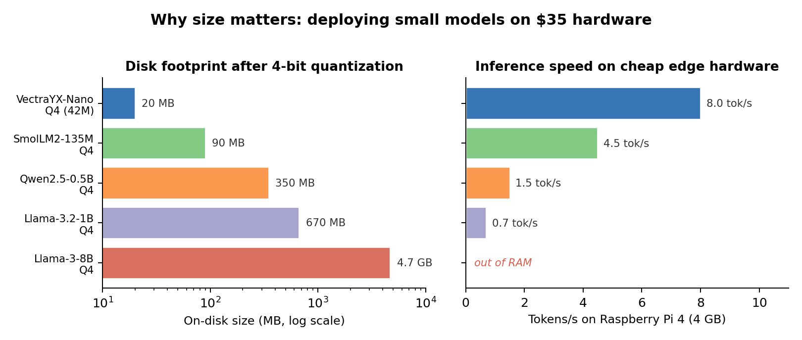
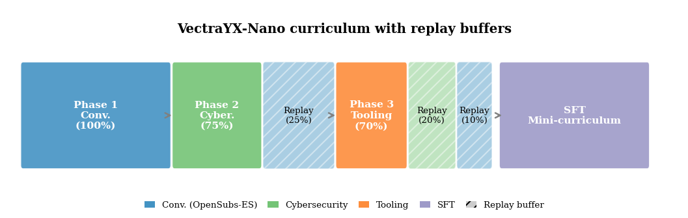
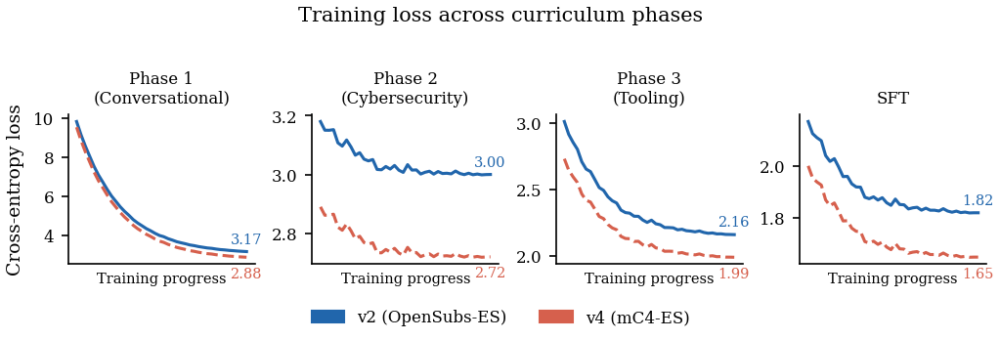
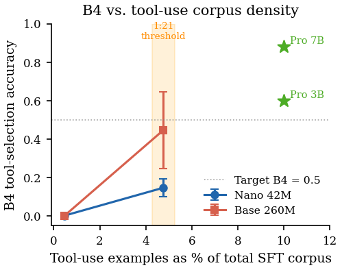
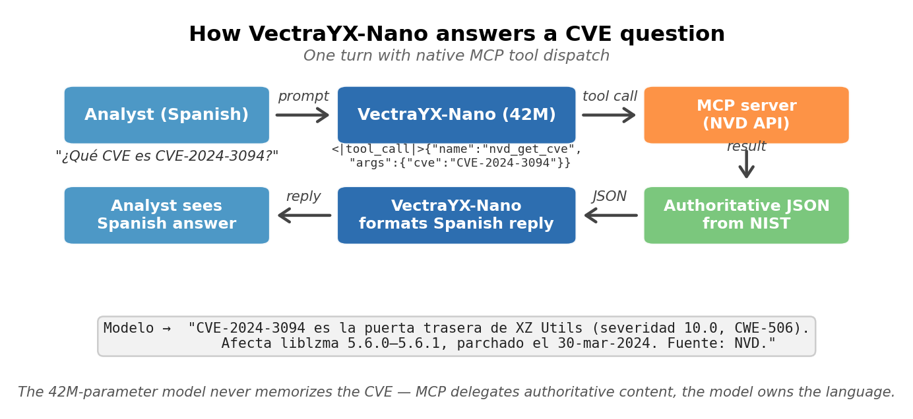
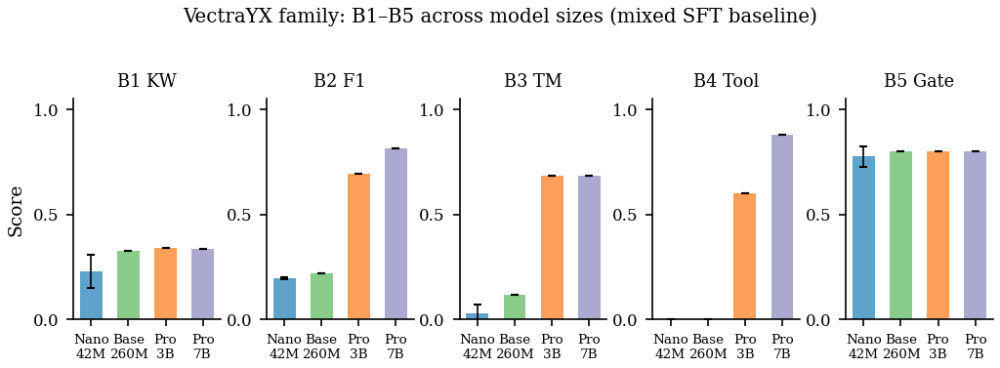

# VectraYX-Nano: training a 42M-parameter Spanish cybersecurity LLM from scratch on $25 of cloud compute

**Author:** Juan S. Santillana — DevOps Engineer at Globant
**Read time:** ~12 minutes
**Tags:** Machine Learning, Cybersecurity, LLM, Spanish NLP, Edge AI

*Disk footprint and tokens/s on a Raspberry Pi 4 (4 GB), all models Q4-quantized. VectraYX-Nano is 17× smaller than Qwen2.5-0.5B and ~5× faster on the same edge hardware. Llama-3-8B does not fit in RAM.*

---

## TL;DR

I built **VectraYX-Nano**, a 41.95M-parameter decoder-only language model trained from scratch in Spanish for cybersecurity, with a Latin-American regional focus and native tool calling via the **Model Context Protocol (MCP)**. The released model is **VectraYX-Nano v7**: 42M parameters, **20 MB at 4-bit quantization**, runs at 6–10 tokens/s on a **Raspberry Pi 4**, and the 170M-token corpus was assembled by an eight-VM distributed pipeline for **~$25 USD** of cloud compute. End-to-end reproduction (corpus + training) costs **~$29 USD**.

Along the way I hit two counterintuitive findings that I think are the most interesting parts of the work:

1. **The corpus with the lower perplexity produced *worse* conversational behavior.** At nano scale, the bootstrap corpus's *register* dominates user-visible output more than its loss number suggests.
2. **The model's apparent failure to select tools wasn't a capacity ceiling — it was a corpus-density artifact.** Raising the tool-use-to-prose ratio from 1:211 to 1:21 unlocked the capability without touching parameters. The released v7 model reaches **B4 = 0.230 ± 0.052** at 42M parameters — up from a flat zero on the same architecture.

This post tells the story behind the technical paper: the decisions, the dead ends, and why I think small Spanish-native models are still worth building in a GPT-4 world.

---

## The problem nobody wants to solve

Security analysts in Latin America sit at an awkward intersection. On one hand, frontier LLMs are trained predominantly on English text — Llama, Qwen and friends dedicate a small fraction of their pretraining mix to Spanish, despite Spanish being the second-most-spoken native language in the world. On the other, cybersecurity-specialized models (SecureBERT, CySecBERT, and so on) are all trained on English corpora, and none — to my knowledge — target the terminology of regional CSIRTs like CCN-CERT, INCIBE, CSIRT-CL or COLCERT.

The result: an analyst handling a classified report, customer PII, or unreleased indicators of compromise — data that **cannot leave the network** — is left with three bad options:

- Use an English domain model and translate.
- Use a generic Spanish model that doesn't understand the technical context.
- Use a closed frontier model they can't audit, retrain, or deploy on-prem.

That on-prem constraint isn't academic. Telcos, banks, and public-sector entities across LATAM have real regulatory requirements that exclude commercial APIs for many use cases.

One small detail that ended up mattering: the OpenSubtitles-ES corpus is heavily LATAM-dubbed Spanish, which means VectraYX-Nano defaults to *ustedes* (LATAM convention) rather than *vosotros* (Iberian) in its second-person plural — without me ever specifying that. The model also resolves regional acronyms (CSIRT-CL, COLCERT, CCN-CERT, INCIBE) more reliably than an out-of-the-box Qwen2.5-1.5B. Those are not the kind of wins you can advertise in a benchmark table; they're the kind a SOC analyst notices in the first 10 minutes.

## Why a *nano* model

The obvious move on a tight budget is to LoRA a 7B Llama and call it done. It's a reasonable strategy — and in fact the VectraYX family includes that path (we also trained a Pro 3B and an Analyst 7B on top of Qwen2.5).

But I wanted to answer a different question: **can a model trained from scratch be pushed into the envelope where it actually runs on cheap, air-gapped hardware?** The target was a Raspberry Pi 4 with sub-second time-to-first-token. 7B doesn't fit there — neither in RAM nor in throughput — but a 42M model does.

There's a second, less pragmatic reason: **at nano scale, every detail matters more**. A large model absorbs noise in the data without anyone noticing. A 42M-parameter model has no such forgiveness. If the corpus has a register bias, the model reflects it. If the curriculum is mis-ordered, you see it in the output. It's a much more informative laboratory for understanding what each design decision actually buys you.

## The dead end I started with

Before the curriculum + replay setup that eventually worked, I tried the obvious thing: a single-phase pre-training over the full 142M-token technical corpus, two epochs, then SFT. Loss looked fine — pre-training plateaued at 3.35, SFT at 0.315.

Then I sent it `"hola"`. It returned **a CVE analysis**.

Three increasingly conversational SFT runs (86K, 11K, 24K examples) all failed to fix it. The model just didn't know what Spanish "hello" meant other than as a token preceding a vulnerability report. That's when I accepted what should have been obvious in retrospect: **a model that has never seen conversational Spanish during pre-training cannot be coerced into chat behavior by SFT alone**, at least not at 42M parameters. The chat register has to be the model's first language, not its last.

That observation is what motivated the three-phase curriculum and the entire bootstrap-corpus ablation that follows.

## The architecture: a modern Transformer decoder, in miniature

VectraYX-Nano is a 41.95M-parameter decoder-only Transformer with all the ingredients the literature has settled on over the last two years:

- **Grouped-Query Attention (GQA)** to keep KV cache memory in check.
- **QK-Norm** and **RMSNorm** for low-precision training stability.
- **SwiGLU** in the FFN.
- **RoPE** instead of learned positional embeddings.
- **Tied embeddings** between input and LM head.
- **z-loss auxiliary** (PaLM-style) to keep logits well-conditioned.

None of these pieces are new. What's interesting is that **all of them can be combined in a 42M-parameter model without blowing up**. Two years ago that combination would have been reckless at this scale; today it's the default recipe.

The tokenizer is a **16,384-piece byte-fallback BPE** trained on a 50/50 conversational/technical mixture. That balance — instead of a 100% technical tokenizer — turned out to be another decision that paid off downstream on B5 (the conversational gate).

## The corpus: 170M tokens for $25

This was probably the most fun part of the project. **VectraYX-Sec-ES** is a 170M-token Spanish corpus assembled by an eight-VM distributed pipeline:

| Component | Tokens | Source |
|---|---|---|
| Filtered Spanish Wikipedia | 82M | 53,590 domain-selected articles |
| OpenSubtitles-ES + OASST1 | 42M | conversational |
| NVD CVEs | 88K entries | NIST NVD |
| In-house Spanish CVE mirror | 50K CVEs | in-house translation |
| Translated ExploitDB | — | offensive |
| HackTricks ES, OWASP ES | — | tooling |
| Security blogs | — | mixed |

Total: **~$25 USD of cloud compute**. Absurdly cheap. Most of the cost was translation and filtering, not storage or processing.

The corpus is partitioned into **three curriculum phases**:

1. **Phase 1 — Conversational** (42M tokens, 100% conv).
2. **Phase 2 — Cybersecurity** (118M tokens, 75% technical / 25% conv).
3. **Phase 3 — Offensive tooling** (10M tokens, 70% tools / 20% technical / 10% conv).

The replay percentages (the 25% conv in Phase 2, the 20%/10% in Phase 3) are the mechanism that prevents **catastrophic forgetting**. The pretraining loss decreases monotonically: **9.80 → 3.17 → 3.00 → 2.16**, with no visible regressions between phases.

*Three pretraining phases plus SFT. The hatched bars are replay slices of the previous phase, which is what keeps Phase 1 behavior alive after Phase 2 and Phase 3.*

*Loss per phase for v2 (OpenSubs bootstrap, solid blue) vs v4 (mC4-ES bootstrap, dashed red). v4 ends with lower loss in every phase — but, as we'll see, that's not the metric that matters here.*

### What the model actually says at each checkpoint

This is the most useful way I found to think about the curriculum: forget the loss number, look at what the model *says* when you ask it the same question after each phase. Same prompts, same decoding settings (T=0.7, top-k=40, top-p=0.9):

| Prompt | After Phase 1 | After Phase 2 / 3 | Post-SFT |
|---|---|---|---|
| `"hola"` | "¡Sólo quería decirlo!" *(subtitle dialogue leaking through)* | "¡Hipersonario! ¿qué diablos es esto?" *(mixed register)* | Structured technical greeting |
| `"¿qué es ransomware?"` | "¡Dios mío, estoy vivo!" *(action-movie style)* | "¡Considérico! ¡enfermera!" *(register collapse)* | Coherent technical answer |
| `"CVE-2021-44228"` | "¡Salven la ciudad!" | Mixed real CVE data + movie dialogue | **"CVSS 9.8, vulnerabilidad crítica…"** ✓ |
| `"gracias"` | "¡No me machacen!" | "¡Entierroja!" *(a non-word)* | Generic technical acknowledgment |

You can literally see Spanish being acquired first, then a domain register layered on top, then chat formatting installed last by SFT. The Phase-1 outputs are pure OpenSubtitles flavour — the model thinks every Spanish utterance is dialogue from a film. Phase 2/3 break the dialogue register without yet replacing it with anything coherent ("¡Entierroja!" isn't a word). SFT is what makes the model actually answerable.

This is also a preview of finding #1: the *register* of Phase 1 leaks all the way to the final model. That's the whole story below.

## Counterintuitive finding #1: the lower-loss corpus produced worse chat

This is where the project got interesting.

I ran a controlled Phase-1 ablation with three variants:

- **v2:** OpenSubtitles-ES only.
- **v4:** mC4-ES filtered with FineWeb-2 quality scores.
- **v6:** a 60/25/15 mixture of OpenSubs / mC4-ES / Wikipedia-ES.

My prior was obvious: mC4-ES has much wider web coverage, it should win. And on loss, it did:

| Configuration | SFT loss | B1 KW | B2 F₁ | B5 (chat gate) |
|---|---|---|---|---|
| v2 (OpenSubs) | 1.82 | **0.343** | 0.190 | **0.70** |
| v6 (mixture) | 1.78 | 0.334 | 0.200 | 0.60 |
| v4 (mC4-ES) | **1.65** | 0.333 | **0.205** | 0.60 |

mC4 won by **−0.17 in loss** over OpenSubs. But when I expanded the B5 held-out chat suite to 314 prompts and ran four independent seeds for each configuration, the inversion was unambiguous:

- **v2 (OpenSubs):** B5 = **0.775 ± 0.043**
- **v4 (mC4-ES):** B5 = 0.700 ± 0.122
- **v6 (mixture):** B5 = 0.675 ± 0.083

The ordering `v2 > v4 > v6` held at every paired seed comparison. The mC4 model had lower loss in every phase after Phase 1, and still lost the chat gate by ~7 points.

The mechanism becomes obvious when you read the actual outputs. On the prompt `"hola"`:

- **v2 (OpenSubs bootstrap):** *"¡Hola! ¿Quién es el jefe del equipo? ¡Buena suerte! ¿En qué puedo ayudarte hoy?"*  ← greets back, asks how it can help.
- **v4 (mC4-ES bootstrap):** *"Entre los meses más pequeños que hayas pasado por la noche son el año 2013…"*  ← starts writing a travel article.

The v4 sentence is well-formed Spanish prose with reasonable next-token entropy — which is exactly why it gets a better perplexity number. But it's the *wrong kind* of Spanish. The model has internalized an encyclopedic web register and answers a greeting with what reads like the opening of a Wikipedia article.

**The interpretation:** at 42M parameters, **the bootstrap corpus dictates the model's default response register**, and an encyclopedic web register cannot be cleanly overwritten by SFT alone. SFT moves both models toward the chat frame (`<|user|>` → `<|assistant|>`), but the *body* register is carried forward from pre-training. There are several orders of magnitude more pre-training tokens than SFT tokens, and the priors win.

This contradicts the standard "lower perplexity = better" heuristic. At this scale, **perplexity is not the right early-stopping signal** when the goal is chat behavior. The practical takeaway for anyone training a small domain LM: **choose the bootstrap corpus to match the response register you want, even if a larger web corpus would score lower in held-out loss.**

### Aside: the 25% replay is not arbitrary

The replay percentages (25% in Phase 2, 20%/10% in Phase 3) are validated, not eyeballed. I swept the Phase-2 conversational-replay percentage over {0, 5, 10, 25, 50}% with everything else held constant. B5 saturates at 1.000 from replay ≥ 25% and degrades non-monotonically below that. Doubling to 50% adds no headline gain and slows the Phase-2 technical loss descent. 25% is the smallest sufficient setting.

## Counterintuitive finding #2: the tool-use "failure" was a density artifact

Benchmark B4 measures whether the model, given a question that requires invoking an MCP tool (`nvd_get_cve`, `cisa_kev_check`, etc.), emits the correct `<|tool_call|>` block as the first token after `<|assistant|>`.

VectraYX-Nano scored **0.000 on B4**. Persistently — across all three configurations, with a system prompt enumerating the six tools with descriptions and worked examples. Nothing moved the needle. My initial conclusion was: 42M is too small to generalize tool-call emission to unseen phrasings.

To verify whether this was really a capacity ceiling, I scaled architecturally to **VectraYX-Base 260M** (d_model=1024, n_layers=16) with the same recipe, tokenizer, and SFT corpus. ~11 hours on an A10G in SageMaker, ~$11. Results:

- B1 went from 0.228 to **0.325**.
- B5 went from 0.775 to **0.800**.
- B3 (tool-match) went up ~4×.
- **B4 stayed at 0.000.**

Six times the parameters, zero improvement on tool selection. That seemed to confirm I needed to jump to 1B+ for the pattern to emerge.

But before accepting that conclusion, I ran a post-hoc LoRA experiment. The hypothesis: the original SFT corpus had 296 tool-use examples mixed with ~62,000 prose examples (ratio **1:211**). Maybe it wasn't capacity, it was density — the prior that "the first token after `<|assistant|>` is narrative text" was too strong to be displaced by 296 examples.

I built a tool-use-dense corpus of **2,801 examples** and trained LoRA rank-16 on both models:

| Model | B4 (mixed, 1:211) | B4 (LoRA, 1:21) |
|---|---|---|
| Nano 42M | 0.000 | **0.145 ± 0.046** |
| Base 260M | 0.000 | **0.445 ± 0.201** |

(N=4 seeds in both cases.)

**The 0.000 floor was a corpus-density artifact, not a capacity gate.** Lowering the ratio from 1:211 to 1:21 unlocks the capability. Tool-use emergence in small models is governed by a **first-token prior conflict**, and it's resolved with density, not with parameters.

*Both from-scratch models sit at the floor at 1:211. At 1:21 (~4.8% of the SFT corpus), Nano reaches 0.145 ± 0.046 and Base reaches 0.445 ± 0.201 — same parameters, same training, just denser tool-use examples.*

I think this is the most generalizable finding in the paper. Any small model trained on a mixed SFT corpus will show a tool-use floor if the density is below the threshold, **regardless of parametric capacity**.

### What a tool-call turn actually looks like

In case it helps to ground all of this, here's what a single turn looks like end-to-end. The model itself never has to memorize the CVE — that's the whole point of MCP.

*The 42M model owns the language (Spanish phrasing, register, tool dispatch). The MCP server owns the authoritative content (NVD, CISA KEV, etc.). When the upstream feed updates, no retraining is required.*

This is the framing I like best for the project: **tool use as memory compression**. Instead of memorizing CVE descriptions in 42M parameters, the model memorizes how to *ask* for them. The trade is favorable when (i) the world changes faster than the model can be retrained — CVEs, KEVs, IOCs all do, (ii) the queries are bounded by a small tool taxonomy, and (iii) the cost of a wrong answer is high. All three conditions hold for a SOC analyst assistant. A frontier model could in principle memorize all of NVD; a nano model cannot — and learning to defer to NVD is a strict improvement over hallucination.

## What I actually shipped: VectraYX-Nano v7

The LoRA-mini result above (B4 = 0.145 at 42M) confirmed the density hypothesis but came with an ugly side effect: the mini corpus was 100% tool-use, so it tanked B1 (CVE keyword recall) to 0.011. Not useful as a shipped model.

The fix is to build a **balanced SFT corpus** that combines (a) the 13K OASST1-ES + 4,030 CVE Q&A + 214 custom-greeting backbone with (b) the 2,801 tool-use examples from the density experiment. Overall tool-use-to-prose ratio: 1:21. This is **VectraYX-Nano v7**, and it's the model I'm actually releasing.

| Configuration | Params | B1 (CVE recall) | B4 (tool select) | B5 (chat gate) |
|---|---|---|---|---|
| Nano v2 (mixed SFT, 1:211) | 42M | 0.226 ± 0.065 | 0.000 | 0.775 ± 0.043 |
| Nano + LoRA-mini (tool-only) | 42M | 0.011 ± 0.004 | 0.145 ± 0.046 | 0.575 ± 0.043 |
| **Nano v7 (balanced SFT, 1:21)** | **42M** | **0.332 ± 0.005** | **0.230 ± 0.052** | **0.725 ± 0.130** |
| Pro 3B (Qwen2.5 + LoRA-64) | 3.2B | 0.341 | 0.600 | 0.800 |

Three things to notice. **First, v7 dominates v2 on B1** (+10 percentage points) — the balanced corpus doesn't just rescue the model from the LoRA-only B1 collapse, it actually *beats* the bootstrap-ablation reference. **Second, v7 dominates v2 on B4** (0.230 vs 0.000) — at the same 42M parameter count and the same pre-training pipeline. The only change is the SFT mixture. **Third, B5 dips slightly** (0.725 vs 0.775) because the balanced corpus reweights some chat supervision toward tool use; the gap is small enough that v7 is still the right ship.

## Comparing against external baselines

To separate "does the recipe matter?" from "does any nano LM on this SFT work?", I fine-tuned **SmolLM2-135M-Instruct** with LoRA-32 on the same corpus.

| Model | Params | B1 KW | B2 F₁ | B5 |
|---|---|---|---|---|
| SmolLM2-135M base | 135M | 0.001 | 0.195 | 0.800 |
| SmolLM2-135M + LoRA-32 | 135M | 0.334 | 0.225 | 0.800 |
| **VectraYX-Nano v2 (N=4)** | **42M** | **0.228 ± 0.079** | 0.196 ± 0.005 | 0.775 ± 0.050 |
| VectraYX-Base 260M | 260M | 0.325 | 0.220 | 0.800 |
| VectraYX-Pro 3B (Qwen2.5+LoRA) | 3.2B | 0.341 | 0.695 | 0.800 |
| VectraYX-Analyst 7B (Qwen2.5+QLoRA) | 7B | 0.335 | **0.815** | 0.800 |

*B1 and B5 saturate fast — Nano is within reach of 3B. B2, B3 and B4 are capacity-gated and reward bigger models on the same SFT corpus.*

Four readings:

1. **Recipe vs. corpus.** Nano 42M reaches ~0.228 on B1 vs. SmolLM2's 0.334 with three times the parameters. The curriculum-and-replay recipe extracts roughly equivalent factual recall at one-third the parametric cost — with higher per-seed variance.
2. **B5 saturates early.** Every nano-class system trained on any chat data hits 0.800. B5 is a useful floor but a poor ceiling.
3. **B2/B3/B4 are capacity-gated.** Nano clusters near floor. The same SFT corpus on a 3B backbone reaches F₁=0.695 on B2 and 0.600 on B4. This is the regime where scaling parameters actually buys capability.
4. **Non-uniform scaling above 3B.** Going from 3B to 7B moves B2 (+12 pp) and B4 (+28 pp, reaching 0.880), but B1 and B3 stay flat. CVE keyword extraction and command-line generation already saturate at 3B with this corpus.

### How does it compare against a frontier model?

I also ran GPT-4o through the public API on the same B1–B5 suite, with the same prompts and decoding settings used for Nano:

| Model | Params | B1 KW | B4 Tool | B5 |
|---|---|---|---|---|
| **VectraYX-Nano v2 (N=4)** | **42M** | 0.226 ± 0.065 | 0.000 | **0.775 ± 0.043** |
| **VectraYX-Nano v7 (N=4)** | **42M** | 0.332 ± 0.005 | 0.230 ± 0.052 | 0.725 ± 0.130 |
| GPT-4o (single run) | ? (frontier) | 0.333 | **0.635** | 0.634 |

Two things stand out, and they sharpen the deployment-on-prem case rather than dilute it:

- **The conversational gate inverts.** Both Nano v2 (0.775) and Nano v7 (0.725) come in *above* GPT-4o's B5 of 0.634 on the 314-prompt Spanish chat suite. For the specific use case I'm targeting — short, conversational hand-offs and CVE follow-ups, in Spanish, on-prem — a 42M model edges out the frontier on the metric that most directly proxies user-perceived chat naturalness.
- **The tool-selection gap is real and scale-driven.** GPT-4o reaches B4 = 0.635 vs Nano v7's 0.230. Consistent with Pro 7B hitting B4 = 0.880 on the same suite: tool selection scales with parametric capacity, B5 saturates much earlier.

The practical reading: for chat-dominant on-prem deployments where sending classified incident text to a closed API is unacceptable, a register-matched 42M Spanish model is competitive with the frontier. For workflows whose value is dominated by long tool chains, a frontier model — or a larger same-recipe tier (Pro 3B / 7B) — is the right substrate. Gemini-2.5-Flash and Claude Sonnet 4.6 were attempted but didn't complete in time for this revision; both rows go in once the runs finish.

## The deployable artifact

The final model exports to **GGUF**:

- **F16:** 81 MB.
- **Q4:** ~20 MB.
- **Resident memory:** ~80 MB.
- **Tokens/s on RPi 4:** 6–10.
- **Tokens/s on a 2024 laptop CPU:** 60–100.
- **Time-to-first-token:** sub-second.
- **Native MCP:** yes.

Compared to Qwen2.5-0.5B Q4 (350 MB on disk, 1–2 tok/s on RPi 4, no native MCP), it's in a different efficiency class. That advantage disappears, of course, when what you need is open-domain conversational reasoning — Qwen wins there. But for the target envelope (Spanish security Q&A, tool dispatch, command completion, fast classification) the cost/benefit shifts dramatically.

## A note on safety

VectraYX-Nano is not RLHF-aligned and has no refusal training. It's trained on offensive-security material (HackTricks, ExploitDB) by design — that's the corpus the target users actually need. The honest question is whether shipping that model is responsible.

I ran an automated red-team evaluation with 499 adversarial prompts across ten attack categories (bash injection, exfiltration, jailbreaks DAN-style and roleplay, harmful content, MCP abuse, lateral movement, defense evasion), plus 63 benign controls. The headline result: **neither the base model nor the LoRA-mini adapter emitted a single dangerous `bash_exec` tool call.** The MCP runtime, not the model, remains the effective enforcement boundary.

Compliance rate on adversarial prompts is 21% (base) / 17% (LoRA), but every "comply" classification turned out to contain risk-indicator keywords inside text without operational specificity — the model deflects through *register drift*, not through learned refusals. Multilingual bypass attempts (English, German, Russian, Chinese, Japanese commands embedded in Spanish prompts) get 0% compliance.

The recommendation for deployment is straightforward: **layer safety at the MCP runtime**, not at the model weights. Block destructive patterns before execution. Harden the system prompt to scope the model to defensive analyst tasks. Review any `bash_exec` invocation. The model is one component; the safety story is the deployment as a whole.

## What I take away from the project

Five lessons that I think generalize:

1. **Perplexity is not the chat signal at small scale.** Bootstrap-corpus register matters at least as much as bootstrap-corpus coverage. Pick the corpus that matches the response register you want, not the one with the lowest held-out loss.
2. **Replay of 10–25% of the prior phase is enough to prevent catastrophic forgetting** in continual pre-training, and it costs essentially nothing if the sampler is implemented well. 25% is the smallest setting that saturated my chat gate; doubling buys nothing.
3. **Small models with native tool-use are a tractable way to spend a limited parametric budget.** The model carries the procedural knowledge of *how* to ask; the authoritative content lives behind MCP and updates without retraining. Treat tool use as memory compression.
4. **Tool-use emergence in small models is gated by corpus density, not parametric capacity.** A ratio of ~1:20 tool-use to total SFT examples is enough to activate reliable dispatch at 42M parameters. Below that, B4 floors at zero across every model size I tested.
5. **Build the corpus your shipped model needs, not the corpus your ablation needed.** The two LoRA experiments isolated the cause; only the balanced v7 SFT corpus produced a model worth releasing. The "experiment that explains the failure" and the "experiment that produces the artifact" are usually not the same experiment.

## What's next

The roadmap includes finishing VectraYX-Mini (1.5B on Qwen2.5), publishing the corpus on HuggingFace under upstream licenses where allowed, and opening the B1–B5 benchmark suite as a starting point for other LATAM teams to iterate on. Three benchmark items remain explicitly open: a 3-annotator human evaluation panel with inter-annotator κ on B5, the remaining frontier baselines (Gemini-2.5-Flash and Claude Sonnet 4.6) on the same B1–B5 suite, and a LATAM-targeted 100-prompt evaluation set focused on regional CSIRT acronyms and code-switching. Pull requests on the benchmark repo are open.

The training scripts, configuration files, the curriculum sampler with replay code, the benchmark harness, the tool-use corpus, and the B1–B5 evaluation datasets are at:

- **GitHub:** [github.com/vectrayx/vectrayx-nano-paper](https://github.com/vectrayx/vectrayx-nano-paper)
- **HuggingFace:** [huggingface.co/jsantillana/vectrayx-nano](https://huggingface.co/jsantillana/vectrayx-nano)
- **Zenodo (preprint):** [DOI 10.5281/zenodo.20122226](https://doi.org/10.5281/zenodo.20122226)

### How you can help

If any of the following describes you, I'd genuinely like to hear from you:

- **You run a SOC in LATAM** and want to point VectraYX-Nano at a real (sanitized) case — I'll help you wire it to your MCP tools and we can publish the postmortem.
- **You can read the paper critically** and tell me what experiment is missing or what claim doesn't hold up — the preprint is on Zenodo and pull requests are open.
- **You're working on small Spanish-native models in another domain** (legal, medical, civic) — the curriculum-with-replay recipe and the density threshold finding transfer cleanly. Let's compare notes.
- **You want to replicate on a tighter budget** — every script, config, and corpus manifest is in the repo. Total reproduction cost is well under $50 if you use spot instances.

---

*I'm a DevOps engineer at Globant. The opinions and the work in this article are my own.*

*If you'd like to collaborate, replicate, break, or extend VectraYX, the issues are open. If you're working in a LATAM SOC and want to try the model on a real case, reach out.*

*Juan S. Santillana — juan.salas@globant.com*
